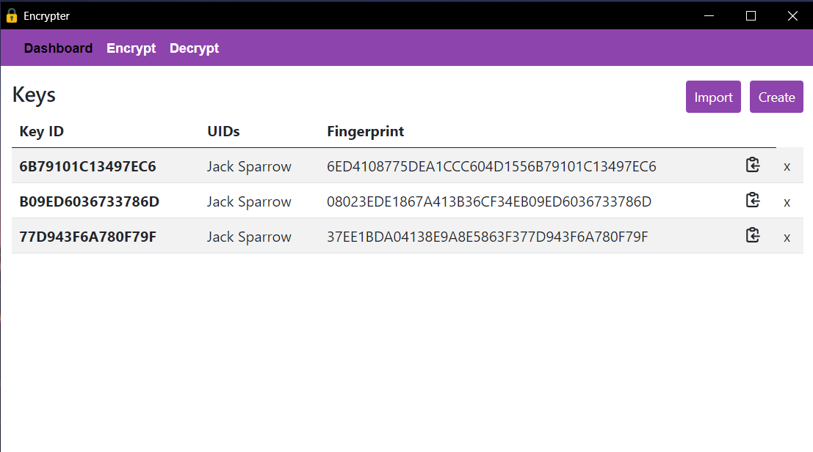

## Encrypter

### Screenshot
 

### Build File
Execute ```build.bat``` batch file.

### Download for windows
[download link](https://drive.google.com/file/d/1FsD1YNCcZzbrgtr71nXqp8QEI2ra1xo6/view?usp=sharing)

### Tech Stack Used
- [python3](https://www.python.org/downloads/)
- HTML/CSS/Javascript
- [Bootstrap](https://getbootstrap.com/)
- [eel](https://pypi.org/project/Eel/#:~:text=Eel%20is%20a%20little%20Python,from%20Javascript%2C%20and%20vice%20versa.)
- [tkinter](https://docs.python.org/3/library/tkinter.html#module-tkinter)
- batch programming
- [GnuPG](https://gnupg.org/)
